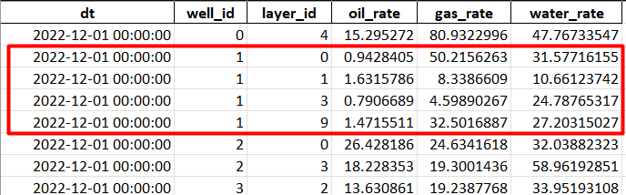

### About

Command to compute rig layer split rates from rig stat input files. It is consciously not optimised for high volume inputs.

### Setup

Setup when using docker compose assuming current working directory in package root:
1. `cp .env.example .env` and change according to your needs
2. Run `docker-compose run composer install`
3. Run samples in `docker-compose run php ./sampleUsage.sh` to verify your setup works
4. Optionally run tests `docker-compose run php vendor/bin/phpunit tests`

### Input\Output

You may pass input files using command arguments e.g. `./rigstats.php compute:allocation $filename`.
Output files are saved in `$(cwd)/output/*` with appropriate suffixes.
Results by default are written to console if and as appropriate.
See input examples in `examples/` dir.

### Validation

For allocation compute source files, layer split data represents rate percentage per layer and must add up to 100% with at least 1e-5 accuracy.
This is checked for validity when running the command.
All other data is assumed to be correct by the contract.
Invalid inputs are likely to fail.

Sample error data for allocation computation when using console output:
```text
Input data contains errors.
Writing plain text (892 bytes) to generic output
At 2022-12-01 #92 for oil: Split data sum error by -41.61%
At 2022-12-01 #154 for gas: Split data sum error by -15.15%
At 2022-12-01 #188 for oil: Split data sum error by 24.91%
At 2022-12-02 #132 for oil: Split data sum error by 31.28%
At 2022-12-03 #132 for gas: Split data sum error by 43.59%
```

Sample error data for allocation computation when using xlsx output:

| dt         | well_id | fluid | error                           |
|------------|---------|-------|---------------------------------|
| 2022-12-01 | 1       | oil   | Split data sum error by -41.61% |

### Computation

For allocation computation layer rates are computed using `layer_rate = well_rate * layer_split / 100`.

Sample content for xlsx allocation output:


Sample content for json allocation output:
```json
{
  "allocation": {
    "data": [
      {
        "wellId": 0,
        "dt": "2022-12-01T00:00:00",
        "layerId": 4,
        "oilRate": 15.29527178593368,
        "gasRate": 80.93229959419733,
        "waterRate": 47.76733547397225
      }
    ]
  }
}
```
